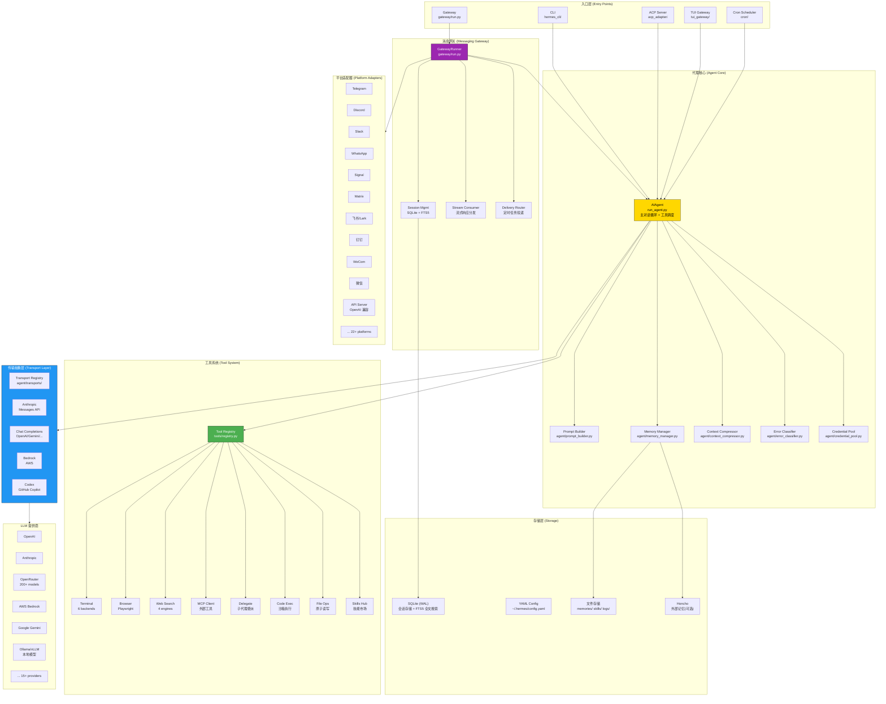

# Hermes Agent 架构总览

## 1. 一句话概括

**Hermes Agent 解决的核心问题是：构建一个具备闭环学习能力的模型无关（model-agnostic）自主 AI 代理——它能在对话中动态创建技能、自我改进技能、持久化记忆，并通过统一网关在 20+ 消息平台上运行，同时支持从本地到无服务器的任意部署环境。**

简单说：**它不是 LLM 的薄封装层，而是一个会越用越"聪明"的自主代理运行时。**

---

## 2. 顶层架构图



### 架构分层解读

| 层级 | 角色 | 核心组件 |
|---|---|---|
| **入口层** | 用户/系统与代理的交互界面 | CLI、Gateway、ACP Server、TUI Gateway、Cron |
| **代理核心** | 对话循环、上下文管理、错误恢复 | `AIAgent`、Prompt Builder、Memory Manager、Context Compressor |
| **传输抽象层** | 抹平不同 LLM 提供商的 API 差异 | Transport Registry + 4 种传输实现 |
| **工具系统** | 代理的能力边界——所有可调用的工具 | Tool Registry + 50+ 工具模块 |
| **消息网关** | 多平台消息的接收、路由、分发 | GatewayRunner + 22 个平台适配器 |
| **存储层** | 持久化会话、配置、记忆、技能 | SQLite (FTS5)、YAML、文件系统、Honcho |

### 核心数据流

```
用户消息 → [平台适配器] → GatewayRunner → AIAgent
                                              ↓
                              1. Memory Manager 预取记忆上下文
                              2. Prompt Builder 组装系统提示词
                              3. Transport 发送请求到 LLM
                              4. LLM 返回响应 (含 tool_calls)
                              5. Tool Registry 调度执行工具
                              6. 工具结果回传 LLM (循环直到最终文本响应)
                              7. Context Compressor (如超出上下文窗口则压缩)
                              8. Memory Manager 同步新记忆
                                              ↓
                            响应 → Stream Consumer → [平台适配器] → 用户
```

---

## 3. 五个最关键的源码目录/包

### 3.1 `run_agent.py` — 代理主循环（约 680K，最大单文件）

这是整个系统的"心脏"。`AIAgent` 类实现了完整的对话循环：
- 构建系统提示词（身份 + 技能索引 + 平台上下文 + 记忆）
- 发送消息到 LLM（经过 Transport 层）
- 解析响应中的工具调用
- 通过 Tool Registry 执行工具
- 循环直到获得最终文本响应
- 更新记忆和会话状态

**关键设计决策**：它不是简单的一次调用，而是一个 **自动工具调用循环**（agentic loop）——模型可以连续调用多个工具，每次调用结果的上下文都会累积，直到模型决定给出最终答案。

### 3.2 `agent/transports/` — 传输抽象层

这是实现 **模型无关性** 的关键。`ProviderTransport` 抽象基类定义了四个方法：

```python
class ProviderTransport(ABC):
    def convert_messages(messages) -> provider_native_messages
    def convert_tools(tools) -> provider_native_tools
    def build_kwargs(messages, tools, ...) -> api_call_kwargs
    def normalize_response(raw_response) -> NormalizedResponse
```

四种传输实现覆盖了所有主流 LLM API 范式：
- **anthropic** — Anthropic Messages API
- **chat_completions** — OpenAI 兼容的 Chat Completions API（覆盖 OpenAI、Gemini、OpenRouter 等大部分提供商）
- **bedrock** — AWS Bedrock
- **codex** — GitHub Copilot/Codex

**价值**：上层 `AIAgent` 完全不感知底层调用的是哪个提供商的 API，所有差异被传输层吸收。

### 3.3 `tools/registry.py` — 工具注册中心

全局单例 `ToolRegistry`，实现了 **自动工具发现与注册机制**：

1. 每个 `tools/*.py` 文件在模块导入时调用 `registry.register()` 自注册
2. `model_tools.py` 通过 AST 分析扫描 `tools/` 目录，自动发现并导入所有工具模块
3. 注册信息包括：tool schema（JSON Schema 格式）、handler 函数、toolset 归属、可用性检查函数
4. 支持 MCP 动态工具的热注册/注销（`deregister()`）

**价值**：添加一个新工具只需创建一个 `tools/xxx.py` 文件并调用 `registry.register()`，无需修改核心代码。工具与代理核心完全解耦。

### 3.4 `gateway/run.py` + `gateway/platforms/` — 多平台消息网关

这是系统的"外交层"，实现了 **一个核心、多端接入** 的架构：

- `GatewayRunner`（`gateway/run.py`，约 554K）管理所有平台连接的生命周期
- `BasePlatformAdapter` 是所有平台适配器的抽象基类
- 22 个平台适配器将各平台的消息格式统一转换为内部格式
- `StreamConsumer` 将代理核心的流式响应分发回正确的平台通道
- `DeliveryRouter` 支持 cron 作业输出投递到指定平台/频道

**价值**：用户可以从手机 Telegram 向代理发消息，而代理在云 VM 上执行任务。底层是无差别的统一处理。

### 3.5 `agent/memory_manager.py` + `agent/context_compressor.py` — 记忆与压缩子系统

这两个模块共同实现了 **闭环学习** 的核心机制：

**MemoryManager**：
- 内置 `MemoryProvider`（默认）加上最多一个外部插件记忆提供商（如 Honcho）
- 每个对话轮次前后：`prefetch_all()` → `sync_all()` 循环
- 记忆上下文通过 `<memory-context>` 标签注入系统提示词，带防泄漏的状态机清洗器
- 支持会话搜索（SQLite FTS5）、记忆写入/更新/删除、子代理记忆传递

**ContextCompressor**：
- 当对话历史超出模型上下文窗口时自动触发
- 使用辅助模型（便宜/快）摘要中间轮次，保护头尾上下文
- 结构化压缩模板：已解决/待处理问题追踪、当前活跃任务标记
- 防止压缩摘要被误解为活跃指令

**价值**：这两个模块是 Hermes 区别于"无状态 LLM 封装器"的本质——代理会记住你是谁、你们讨论过什么、哪些任务在进行中。

---

## 4. 竞品架构理念对比

| 维度 | **Hermes Agent** | **LangChain/LangGraph** | **AutoGPT** | **Claude Code** | **CrewAI** |
|---|---|---|---|---|---|
| **核心定位** | 通用自主代理运行时 + 自我进化 | 开发者框架/工具链 | 自主任务执行器 | IDE 集成编码助手 | 多智能体协作框架 |
| **模型无关性** | 原生支持 15+ 提供商，Transport 层抽象 | 通过 LLM 抽象层支持多种 AI | 主要绑定 OpenAI | 仅 Anthropic Claude | 通过 LangChain 支持多种 |
| **学习机制** | 闭环：技能创建→自改进→持久记忆→用户建模 | 无内建学习，依赖 LangSmith 外部跟踪 | 基本记忆，无自我改进 | 通过 CLAUDE.md 和环境感知 | 无内建学习机制 |
| **部署模型** | CLI + 容器 + 无服务器(Modal/Daytona) + SSH + HPC | 代码库/库依赖 | Docker + 本地 | IDE 内（VS Code/JetBrains） | Python 库 |
| **工具系统** | 自注册 + AST 自动发现 + 运行时热注册 | 声明式 Tool 定义 | 插件式命令注册 | 内建 CLI + Bash 工具 | 通过 LangChain Tools |
| **多端接入** | 22 平台统一网关（CLI/MSG/API） | 无原生网关 | Web UI + API | 终端/IDE | 无原生网关 |
| **上下文管理** | 自动压缩 + 分片 + 智能裁剪 + 提示缓存 | 手动管理 + LangSmith 追踪 | 基础 | 自动压缩 + 缓存 | 基础 |
| **扩展性** | 插件系统 + MCP + ACP + Skills Hub 市场 | 丰富生态（但耦合框架） | 有限插件 | 较为封闭 | 通过 LangChain 生态 |
| **研究/训练** | 内建 RL 训练(Atropos) + SWE-bench/Terminal-Bench 基准 | 评估框架(LangSmith) | 无 | 无 | 无 |
| **安全模型** | 多层：命令审批 + URL 安全 + 容器隔离 + TIRITH 集成 | 取决于实现 | 基础同意机制 | 权限系统 | 取决于实现 |
| **代码量级** | 单体核心 + 模块化工具（50 万+ 行 Python） | 分散的多包架构 | 中等 | 专有 | 中等 |

### 核心差异化总结

1. **Hermes 是"越用越聪明"的代理**，其他大部分是"每次从零开始"的工具
2. **Hermes 的模型无关性是架构级设计**（Transport 层），而非简单的接口封装
3. **Hermes 同时面向开发者、普通用户和研究人员**（CLI + 多端 MSG + RL 训练），覆盖最广的使用场景
4. **Hermes 的部署灵活性**（本地→容器→无服务器→HPC→SSH 跳板）在同类项目中独树一帜

---

## 5. 背景知识清单

### 5.1 大语言模型(LLM)基础
- **Chat Completions API 范式**：理解 OpenAI 风格的 `{role, content, tool_calls}` 消息格式
- **Function Calling / Tool Use**：理解 LLM 如何通过 JSON Schema 定义的工具调用外部函数
- **Token 与上下文窗口**：token 估算方法、上下文限制、提示缓存机制
- **流式响应 (SSE/Streaming)**：server-sent events 和增量式响应处理

### 5.2 代理架构模式
- **Agentic Loop（代理循环）**：`思考→行动→观察→思考→...` 的 ReAct 模式
- **Tool Registration Pattern（工具注册模式）**：通过注册表解耦工具声明与调用
- **Provider Adapter Pattern（提供商适配器模式）**：通过抽象层统一不同 API 的差异
- **Context Compression（上下文压缩）**：长对话历史的自动摘要和裁剪策略

### 5.3 协议与标准
- **MCP (Model Context Protocol)**：Anthropic 提出的模型-工具通信标准协议
- **ACP (Agent Communication Protocol)**：代理间通信协议（编辑器/IDE 集成）
- **OpenAI Chat Completions API**：事实上的行业标准接口格式
- **JSON Schema**：工具参数定义的标准化描述语言

### 5.4 消息平台 API
- **Telegram Bot API**：长轮询 vs Webhook 两种接入模式
- **Discord Gateway API**：WebSocket 事件驱动的实时消息
- **Slack Bolt Framework**：Socket Mode 和 HTTP 模式
- **Matrix 协议**：去中心化联邦通信协议（mautrix 客户端库）
- **企业 IM（飞书/钉钉/WeCom）**：中国主流企业办公平台的开放 API

### 5.5 基础设施与工具
- **Playwright**：Chromium 驱动的浏览器自动化框架
- **SQLite WAL + FTS5**：Write-Ahead Logging 模式 + 全文搜索引擎
- **Docker 容器化**：无根用户运行、卷挂载、多阶段构建
- **Nix Flakes**：可重复构建和声明式系统配置
- **Modal / Daytona**：无服务器 GPU 计算和开发环境即服务
- **SSH 远程执行**：通过 SSH 跳板连接远程机器执行命令

### 5.6 AI/ML 研究概念
- **RLHF / RL Training (Atropos)**：基于强化学习的代理行为优化
- **SWE-bench**：软件工程任务基准评测
- **Terminal-Bench**：终端命令执行基准评测
- **Trajectory Collection**：代理行为轨迹的数据收集和压缩
- **Dialectic User Modeling (Honcho)**：辩证用户建模——通过与用户的持续对话构建偏好模型

### 5.7 安全与防护
- **Prompt Injection Detection**：上下文文件中的提示注入检测
- **Command Approval Pattern**：危险命令的自动检测与人工审批
- **URL Safety Checking**：URL 目标安全性验证
- **Credential Rotation**：多凭证池的故障转移和轮换机制

---

## 延伸阅读

| 文档 | 内容 |
|---|---|
| [02 - AIAgent 主循环详解](./02-AIAgent主循环详解.md) | `AIAgent` 主类的完整数据流、状态管理、错误恢复 |
| [03 - 传输抽象层](./03-传输抽象层-模型无关性.md) | 多提供商适配的 Transport 层实现、提示缓存 |
| [04 - 工具系统](./04-工具系统-ToolRegistry.md) | ToolRegistry 注册、发现、调度的完整机制 |
| [05 - 提示词组装](./05-提示词组装与上下文管理.md) | 系统提示词七层结构、上下文文件安全扫描 |
| [06 - 记忆与压缩](./06-记忆系统与上下文压缩.md) | MemoryManager 编排、ContextCompressor 压缩算法 |
| [07 - 消息网关](./07-消息网关-多平台接入.md) | GatewayRunner、Session 管理、22 平台适配器 |
| [08 - 技能系统](./08-技能系统-代理自我进化.md) | 技能创建/改进/分享、Skills Hub 市场 |
| [09 - 安全模型](./09-安全模型与审批.md) | 六层纵深防御：注入检测、命令审批、URL/文件安全 |
| [10 - 插件与扩展](./10-插件系统与扩展机制.md) | 插件、MCP、ACP 三种扩展机制 |
| [11 - 部署与配置](./11-部署-配置与CLI.md) | 多种部署模式、CLI 架构、配置系统 |
| [12 - 开发入门与调试](./12-开发入门与调试.md) | 环境搭建、调试技术、常见开发任务 |
