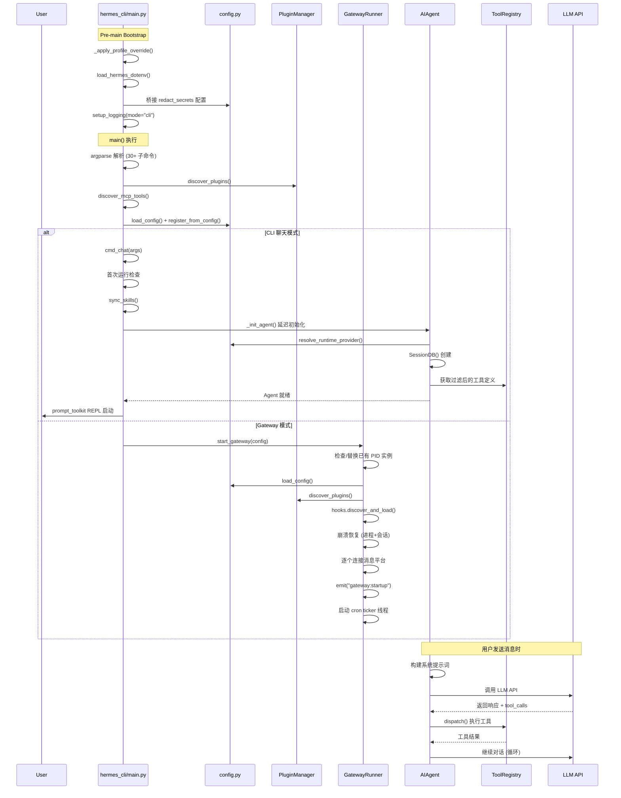

# 启动流程

本文从入口函数出发，沿着调用链详细讲解 Hermes Agent 的完整启动流程，涵盖配置加载、对象初始化、服务注册与启动顺序，以及事件驱动的生命周期。

## 1. 项目概述

Hermes Agent 是一个**自我改进的 AI 代理**，具备内建学习循环——从经验中创建技能、跨会话建立用户模型、支持多平台消息网关。项目采用 Python (>=3.11) 编写，使用 setuptools 打包。

项目提供 **4 个入口点**，对应不同的运行模式：

| 入口命令 | 模块 | 运行模式 |
|---|---|---|
| `hermes` | `hermes_cli/main.py:main()` | CLI 交互式聊天 / 管理命令 |
| `hermes gateway` | `gateway/run.py:main()` | 多平台消息网关守护进程 |
| `hermes acp` | `acp_adapter/entry.py:main()` | ACP 协议服务器（编辑器集成） |
| `hermes-agent` | `run_agent.py:main()` | 直接代理模式（单次查询） |

所有这些入口最终都汇聚到同一个核心——`run_agent.py` 中的 `AIAgent` 类。

## 2. 启动前引导（Pre-Main Bootstrap）

在 `main()` 函数被调用之前，`hermes_cli/main.py` 的**模块级代码**会执行一系列关键的初始化步骤。这些步骤的顺序非常重要，后续模块导入依赖于它们设置的全局状态。

### 2.1 Profile 覆写（第 100-161 行）

```python
# hermes_cli/main.py, 模块级代码
_apply_profile_override()
```

这是最先执行的操作。`_apply_profile_override()` 在**任何 hermes 模块导入之前**预解析 `sys.argv`，查找 `--profile`/`-p` 参数，并设置 `HERMES_HOME` 环境变量。原因：许多模块在导入时缓存 `HERMES_HOME` 为模块级常量，必须先设置环境变量才能确保所有后续 `os.getenv("HERMES_HOME", ...)` 解析正确。

解析优先级：
1. 命令行 `--profile <name>` 或 `-p <name>` 标志
2. `~/.hermes/active_profile` 文件中的 sticky 默认值
3. 如果都没有，保持默认的 `~/.hermes`

### 2.2 .env 文件加载（第 165-168 行）

```python
from hermes_cli.env_loader import load_hermes_dotenv
load_hermes_dotenv(project_env=PROJECT_ROOT / ".env")
```

加载顺序：先加载 `~/.hermes/.env`（用户级别），再回退到 `$PROJECT_ROOT/.env`（项目级别）。使用 `python-dotenv` 将密钥/配置注入 `os.environ`。

### 2.3 安全红action 配置桥接（第 175-189 行）

```python
if "HERMES_REDACT_SECRETS" not in os.environ:
    # 从 config.yaml 读取 security.redact_secrets
    # 设置为 HERMES_REDACT_SECRETS 环境变量
```

这一步必须在 `hermes_logging` 模块导入**之前**完成——因为该模块在导入时快照 `HERMES_REDACT_SECRETS` 环境变量，之后不再重新读取。如果在 `.env` 中已设置，则跳过（`.env` 优先级高于 `config.yaml`）。

### 2.4 日志系统与网络偏好（第 193-211 行）

```python
from hermes_logging import setup_logging
_setup_logging(mode="cli")

from hermes_cli.config import load_config
from hermes_constants import apply_ipv4_preference
```

设置 `agent.log` + `errors.log` 文件日志，并根据配置应用 IPv4 优先策略（通过 `HERMES_FORCE_IPV4` 环境变量）。

## 3. 配置系统详解

配置系统是整个启动流程的基础设施，核心实现在 `hermes_cli/config.py` 中。

### 3.1 配置存储位置

| 文件 | 路径 | 用途 |
|---|---|---|
| `config.yaml` | `~/.hermes/config.yaml` | 结构化行为配置 |
| `.env` | `~/.hermes/.env` | 密钥和环境变量 |
| `active_profile` | `~/.hermes/active_profile` | 当前活跃 profile 名称 |

### 3.2 load_config() 加载流程

```python
# hermes_cli/config.py:3411
def load_config() -> Dict[str, Any]:
    ensure_hermes_home()
    config = copy.deepcopy(DEFAULT_CONFIG)        # 1. 从硬编码默认值开始

    if config_path.exists():
        user_config = yaml.safe_load(f) or {}     # 2. 读取 YAML
        config = _deep_merge(config, user_config)  # 3. 深度合并用户配置

    normalized = _normalize_root_model_keys(...)   # 4. 向后兼容规范化
    expanded = _expand_env_vars(normalized)        # 5. ${VAR} 环境变量展开
    _LAST_EXPANDED_CONFIG_BY_PATH[...] = expanded  # 6. 缓存已展开结果
    return expanded
```

**第一步 — DEFAULT_CONFIG**：`hermes_cli/config.py` 中定义的一个大型硬编码字典（约 300 行），包含所有配置项的默认值：模型设置、终端配置、浏览器配置、TTS、工具权限、skill 设置等。

**第二步 — YAML 读取**：使用 `yaml.safe_load()` 读取 `~/.hermes/config.yaml`。只支持 YAML 格式。

**第三步 — 深度合并**：`_deep_merge()` 递归合并，用户配置覆盖默认值。数组也会被替换而非拼接。

**第四步 — 向后兼容规范化**：
- `_normalize_root_model_keys()`：将旧版根级 `provider`/`base_url` 迁移到 `model:` 段
- `_normalize_max_turns_config()`：将顶级 `max_turns` 迁移到 `agent.max_turns`

**第五步 — 环境变量展开**：递归遍历整个配置树，将 `${VAR_NAME}` 占位符替换为 `os.environ` 中的实际值。

**第六步 — 缓存**：已展开的配置按路径缓存，避免重复解析。

### 3.3 .env 文件格式

```
# ~/.hermes/.env
ANTHROPIC_API_KEY=sk-ant-...
OPENAI_API_KEY=sk-...
TELEGRAM_BOT_TOKEN=123:abc
```

通过 `python-dotenv` 加载到 `os.environ`，所有配置键值均可通过环境变量引用。

### 3.4 运行时凭证解析

当实际调用模型 API 时，凭证解析由 `hermes_cli/runtime_provider.py` 中的 `resolve_runtime_provider()` 完成。它合并四个来源：

1. **config.yaml** 的 `model:` 段（provider、base_url、api_key 占位符）
2. **环境变量**（`ANTHROPIC_API_KEY`、`OPENAI_API_KEY` 等，由 `.env` 注入）
3. **models.dev 目录**（第三方模型数据库，提供 API 端点信息）
4. **Hermes overlays**（`hermes_cli/providers.py` 中的 `HERMES_OVERLAYS` 映射，定义每个 provider 的传输类型、认证方式、环境变量名）

## 4. 入口点与完整调用链

### 4.1 CLI 交互模式（`hermes chat` 默认）

这是最常用的入口，完整的调用链如下：

```
hermes (可执行脚本)
  └─ hermes_cli/main.py:main()                          # 参数解析 + 子命令分发
       ├─ 解析 argparse, 注册 30+ 子命令
       ├─ discover_plugins()                             # Python 插件发现
       ├─ discover_mcp_tools()                           # MCP 工具发现
       ├─ register_from_config(load_config())            # Shell hook 注册
       └─ cmd_chat(args)                                # → 聊天子命令
            ├─ _has_any_provider_configured()            # 首次运行检查
            ├─ prefetch_update_check()                   # 后台检查更新
            ├─ sync_skills(quiet=True)                   # 同步内置 skills
            ├─ 设置环境变量 (YOLO/ignore_rules/source)
            └─ cli.main(**kwargs)                       # 进入 CLI 主程序
                 └─ cli.py:main()
                      ├─ _setup_worktree()               # 可选: Git worktree 隔离
                      ├─ HermesCLI(...)                  # 创建 CLI 实例
                      └─ cli.run()                      # 启动 prompt_toolkit REPL
                           └─ 用户输入时 → cli.chat()
                                └─ _init_agent()          # 延迟初始化 Agent
                                     ├─ _ensure_runtime_credentials()
                                     │    └─ resolve_runtime_provider()  # 凭证解析
                                     ├─ SessionDB()       # SQLite 会话存储
                                     ├─ 恢复会话历史 (如果 --resume)
                                     └─ AIAgent(...)      # 创建核心 Agent
```

#### 关键步骤详解

**参数解析** (`main()`, 第 7714 行)：
- 使用 `argparse` 构建完整的命令行解析器
- 顶级参数包括 `--model/-m`、`--provider`、`--resume/-r`、`--continue/-c`、`--tui`、`--yolo` 等
- 注册 30+ 子命令，每个通过 `parser.set_defaults(func=cmd_xxx)` 关联处理函数
- 对于 python < 3.11 有额外的 argparse 兼容处理

**Agent 命令引导** (第 10167-10205 行)：
在执行任何会运行 Agent 的命令之前（`chat`、`acp`、`rl`、`cron run`、`gateway run`、`mcp serve`），执行三项初始化：

```python
discover_plugins()                                    # 1. 发现并加载 Python 插件
discover_mcp_tools()                                  # 2. 发现 MCP 工具
register_from_config(load_config(), accept_hooks=...) # 3. 注册声明式 shell hooks
```

这三个步骤是**幂等的**，仅针对 Agent 命令执行（管理命令如 `hermes config`、`hermes doctor` 不触发它们）。

**cmd_chat** (第 1159 行)：
1. 解析 `--continue`/`--resume` 为实际 session ID
2. 首次运行检查：如果没有配置任何 provider，提示运行 `hermes setup`
3. 后台触发更新检查
4. 同步 skills
5. 设置 `HERMES_YOLO_MODE`、`HERMES_IGNORE_USER_CONFIG` 等环境变量
6. 如果是 TUI 模式，启动 Node.js TUI 子进程；否则进入 Python CLI

**_init_agent** (`cli.py`, 第 3402 行)：
Agent 采用**延迟初始化**策略——只有用户第一次发送消息时才创建 `AIAgent` 实例：

```python
def _init_agent(self, ...):
    if self.agent is not None:        # 已初始化，直接返回
        return True
    self._ensure_runtime_credentials() # 解析 API key/URL/provider
    self._session_db = SessionDB()     # SQLite 会话数据库
    # 如果 --resume，从 SQLite 恢复对话历史
    self.agent = AIAgent(
        model=..., api_key=..., base_url=..., provider=...,
        enabled_toolsets=..., session_id=..., session_db=...,
        # 30+ 参数...
    )
```

### 4.2 Gateway 多平台消息网关（`hermes gateway`）

Gateway 作为**守护进程**运行，管理多个消息平台的连接。完整调用链：

```
gateway/run.py:main()                                  # 入口
  └─ asyncio.run(start_gateway(config))                # 异步主循环
       ├─ 检查/替换已有 gateway 实例 (PID 文件锁)
       ├─ sync_skills()                                # 同步 skills
       ├─ setup_logging(mode="gateway")                # 日志系统
       ├─ GatewayRunner(config)                        # 创建 Runner
       │    ├─ SessionStore()                          # 会话存储
       │    ├─ DeliveryRouter()                        # 消息路由
       │    └─ HookRegistry()                          # 事件钩子系统
       ├─ 注册 SIGINT/SIGTERM/SIGUSR1 信号处理器
       ├─ 写 PID 文件 + atexit 清理
       ├─ discover_mcp_tools()                         # MCP 工具发现
       └─ await runner.start()                         # Gateway 启动
            ├─ discover_plugins()                      # 插件发现
            ├─ register_from_config(...)               # Shell hooks
            ├─ self.hooks.discover_and_load()          # 事件 hooks
            ├─ process_registry.recover_from_checkpoint() # 崩溃恢复
            ├─ self.session_store.suspend_recently_active() # 挂起中断会话
            ├─ self._suspend_stuck_loop_sessions()     # 卡循环检测
            ├─ 遍历 self.config.platforms:             # 连接各平台
            │    ├─ self._create_adapter(platform, config)
            │    ├─ adapter.set_message_handler(...)
            │    └─ await adapter.connect()
            ├─ self.delivery_router.adapters = ...     # 更新路由
            ├─ await self.hooks.emit("gateway:startup") # 触发启动事件
            └─ 启动 cron ticker 后台线程
```

#### GatewayRunner.start() 初始化顺序

Gateway 的初始化顺序经过精心设计，每个步骤依赖前一步的结果：

| 步骤 | 操作 | 作用 |
|---|---|---|
| 1 | 插件发现 `discover_plugins()` | 先于 shell hooks，让插件阻止决策优先生效 |
| 2 | Shell hooks 注册 `register_from_config()` | 声明式 hooks，从 config.yaml 读取 |
| 3 | 事件 hooks 发现 `self.hooks.discover_and_load()` | 扫描 `~/.hermes/hooks/` 目录 |
| 4 | 进程恢复 `process_registry.recover_from_checkpoint()` | 从上一次运行时恢复后台进程 |
| 5 | 会话挂起 `session_store.suspend_recently_active()` | 防止重启后僵尸会话 |
| 6 | 卡循环检测 `_suspend_stuck_loop_sessions()` | 检测 3+ 次连续重启的卡死会话 |
| 7 | 平台连接 `adapter.connect()` | 串行连接各平台适配器 |
| 8 | 路由更新 `delivery_router.adapters = ...` | 将已连接的适配器注入路由 |
| 9 | 发射 `gateway:startup` 事件 | 通知所有 hooks 系统已就绪 |

### 4.3 ACP 协议模式（`hermes acp`）

```
acp_adapter/entry.py:main()
  └─ 启动 ACP 服务器（代理通信协议）
       └─ 为编辑器（VS Code/JetBrains）提供代理集成
```

ACP 模式允许 Hermes 作为**编辑器内 AI 代理**运行，通过标准化的 ACP 协议与编辑器通信。

### 4.4 直接代理模式（`hermes-agent`）

```
run_agent.py:main()
  ├─ 可选: --list_tools → 打印工具列表并退出
  ├─ AIAgent(model=..., api_key=..., ...)
  └─ agent.run_conversation(user_query)
```

这是最简洁的入口，用于脚本、批处理和测试场景。

## 5. 对象创建与依赖管理

Hermes Agent **没有使用正式的依赖注入容器**（无 DI 框架、无 IoC 容器、无 Service Locator）。项目采用以下替代模式：

### 5.1 模块级单例（Module-Level Singleton）

这是项目中最主要的对象共享模式。关键单例：

**ToolRegistry** (`tools/registry.py:100`)：
```python
class ToolRegistry:
    _instance = None
    def __new__(cls):
        if cls._instance is None:
            cls._instance = super().__new__(cls)
            # 初始化...
        return cls._instance

registry = ToolRegistry()  # 模块级实例
```

线程安全，使用 `threading.RLock()` 保护注册和查询操作。

**PluginManager** (`hermes_cli/plugins.py:1059`)：
```python
_plugin_manager: Optional[PluginManager] = None

def get_plugin_manager() -> PluginManager:
    global _plugin_manager
    if _plugin_manager is None:
        _plugin_manager = PluginManager()
    return _plugin_manager
```

### 5.2 直接构造（Direct Construction）

这是创建核心对象的唯一方式——所有依赖以参数形式传入构造函数。

`AIAgent.__init__()` (`run_agent.py:840`) 接受 **50+ 个显式参数**：

```python
def __init__(
    self,
    base_url: str = None,
    api_key: str = None,
    provider: str = None,
    api_mode: str = None,
    model: str = "",
    max_iterations: int = 90,
    enabled_toolsets: List[str] = None,
    session_id: str = None,
    session_db=None,
    tool_progress_callback: callable = None,
    stream_delta_callback: callable = None,
    # ... 还有 40+ 个参数
):
```

这种设计虽然参数列表长，但依赖关系完全透明——每个参数的含义和来源一目了然，无需理解框架的自动装配逻辑。

### 5.3 工具自注册（Tool Self-Registration）

工具通过**模块导入时自动注册**的方式集成到系统中：

```python
# tools/web_tools.py (模块级代码)
from tools.registry import registry

registry.register(
    name="web_search",
    toolset="search",
    schema={...},        # OpenAI 格式的工具 schema
    handler=web_search,  # 实际执行函数
)
```

发现流程 (`tools/registry.py:56`)：
```python
def discover_builtin_tools():
    for py_file in tools_dir.glob("*.py"):
        # AST 解析文件内容，查找 "registry.register(" 调用
        if has_register_call(py_file):
            importlib.import_module(f"tools.{py_file.stem}")
            # 导入触发了模块级的 registry.register() 调用
```

使用 **AST 静态分析**而非盲目导入，避免不必要的模块加载。

### 5.4 对象生命周期总结

```
导入时创建:
  ├─ ToolRegistry (模块级单例)
  ├─ PluginManager (延迟获取的单例)
  └─ DEFAULT_CONFIG (作为 load_config() 的基线)

启动时创建:
  ├─ SessionDB (SQLite 连接)
  ├─ HermesCLI / GatewayRunner (运行模式适配)
  └─ HookRegistry (仅 Gateway 模式)

按需创建（延迟初始化）:
  └─ AIAgent (用户首次发消息时)
```

## 6. 核心服务注册与启动顺序

### 6.1 工具系统启动

工具是 Hermes Agent 最核心的能力，其发现和注册经历了多层架构：

```
1. tools/registry.py 模块导入
     └─ registry = ToolRegistry()           # 创建全局单例

2. model_tools.py 模块导入
     └─ discover_builtin_tools()            # AST 扫描 tools/*.py
          └─ import 触发 registry.register() # 每个工具文件注册自己

3. 入口点启动时
     ├─ discover_plugins()                  # 插件可注册额外工具
     └─ discover_mcp_tools()               # MCP 服务器提供工具
```

### 6.2 插件系统启动

插件从 **4 个来源** 按优先级依次扫描：

| 优先级 | 来源 | 路径 |
|---|---|---|
| 1 (最低) | Bundled | `<repo>/plugins/<name>/` |
| 2 | User | `~/.hermes/plugins/<name>/` |
| 3 | Project | `./.hermes/plugins/<name>/`（需 `HERMES_ENABLE_PROJECT_PLUGINS`） |
| 4 (最高) | Pip | `hermes_agent.plugins` entry point |

后发现的同名插件覆盖先发现的。插件的 `register(ctx)` 函数通过 `PluginContext` facade 注册工具、hooks、命令、skills 等。

### 6.3 Gateway 模式完整启动时间线

```
T=0     main()
T=1     ├─ 检查/替换已有 PID 实例
T=2     ├─ sync_skills()
T=3     ├─ setup_logging(mode="gateway")
T=4     ├─ GatewayRunner.__init__()
        │    ├─ SessionStore()
        │    ├─ DeliveryRouter()
        │    └─ HookRegistry()
T=5     ├─ 信号处理器注册
T=6     ├─ PID 文件声明 + atexit 清理
T=7     ├─ discover_mcp_tools()
T=8     ├─ await runner.start()
        │    ├─ discover_plugins()
        │    ├─ register_from_config()
        │    ├─ hooks.discover_and_load()
        │    ├─ 崩溃恢复 (进程 + 会话)
        │    ├─ 平台连接 (逐个串行)
        │    └─ emit("gateway:startup")
T=9     ├─ 启动 cron ticker 后台线程
T=10    └─ await runner.wait_for_shutdown()  # 阻塞等待
```

## 7. 事件驱动的启动阶段

Hermes 有两套并行的 Hook 系统。

### 7.1 HookRegistry 事件系统

定义在 `gateway/hooks.py`，是一个**文件系统驱动**的事件系统。Hooks 从 `~/.hermes/hooks/` 目录发现，每个 hook 包含 `HOOK.yaml`（元数据）和 `handler.py`（处理逻辑）。

**事件类型**：

| 事件 | 触发时机 | 触发位置 |
|---|---|---|
| `gateway:startup` | Gateway 所有平台连接完成 | `gateway/run.py:2415` |
| `session:start` | 新会话创建 | `gateway/run.py:4433` |
| `session:end` | 会话结束 | `gateway/run.py:5471` |
| `session:reset` | 会话重置完成 | session 模块 |
| `agent:start` | Agent 开始处理消息 | `gateway/run.py:4946` |
| `agent:step` | Agent 循环的每个回合 | `gateway/run.py` step callback |
| `agent:end` | Agent 完成处理 | `gateway/run.py:5083` |
| `command:*` | 任何斜杠命令执行（通配符匹配） | 命令处理模块 |

**内置 Hook — boot-md**：
系统内置了一个 `boot-md` hook，监听 `gateway:startup` 事件。如果 `~/.hermes/BOOT.md` 文件存在，它会在 Gateway 启动时将其内容作为系统级指令加载到 Agent 中。

### 7.2 插件 Hook 系统

定义在 `hermes_cli/plugins.py`。这是一套用于 **Python 插件** 的 Hook 系统。

**22 个有效 Hook 点**：

生命周期 Hooks：
- `on_session_start` / `on_session_end` / `on_session_finalize` / `on_session_reset`

LLM 调用 Hooks：
- `pre_llm_call` / `post_llm_call` — 允许插件注入上下文或处理响应
- `pre_api_request` / `post_api_request` — API 请求拦截

工具执行 Hooks：
- `pre_tool_call` / `post_tool_call`
- `transform_terminal_output` / `transform_tool_result`

Gateway Hooks：
- `pre_gateway_dispatch` — 消息分发前拦截（可返回 skip/rewrite）
- `subagent_stop` — 子代理停止

审批 Hooks：
- `pre_approval_request` / `post_approval_response` — 观察者模式，不可修改

### 7.3 事件触发时间线（Gateway 模式）

```
用户发送消息
  │
  ├─ session:start       (如果是新会话)
  ├─ agent:start          (Agent 开始处理)
  │    ├─ agent:step      (回合 1)
  │    │    ├─ pre_llm_call     (插件注入上下文)
  │    │    ├─ LLM API 调用
  │    │    ├─ pre_tool_call    (每个工具调用)
  │    │    ├─ post_tool_call
  │    │    └─ (更多回合...)
  │    ├─ agent:step      (回合 2...N)
  │    └─ ...
  ├─ agent:end            (Agent 完成)
  └─ session:end          (如果用户 /reset 或 /new)
```

## 8. Agent 会话生命周期

### 8.1 AIAgent 初始化（`run_agent.py:840`）

`AIAgent.__init__()` 在初始化时按以下顺序设置：

```
1. _install_safe_stdio()               # 保护 stdout/stderr 防管道断开
2. 存储核心参数 (model, max_iterations, ...)
3. 传输/API 模式自动检测               # anthropic_messages/chat_completions/codex_responses
4. 预加热传输缓存 + OpenRouter 元数据后台获取
5. 工具执行状态初始化 (interrupt, steer, concurrent workers)
6. 子代理委托状态 (_delegate_depth, _active_children)
7. 工具集过滤 (enabled_toolsets, disabled_toolsets)
8. Prompt 缓存配置 (Anthropic 模型自动启用)
9. 迭代预算创建 (IterationBudget)
10. 日志/追踪设置 (setup_logging, 幂等)
```

### 8.2 run_conversation 主循环（`run_agent.py:9773`）

```python
def run_conversation(self, user_message: str, ...) -> Dict[str, Any]:
    # ── 准备阶段 ──
    _install_safe_stdio()                        # 管道保护
    set_session_context(self.session_id)          # 日志上下文
    self._restore_primary_runtime()              # 恢复主线模型
    user_message = _sanitize_surrogates(...)     # Unicode 清理
    self._current_task_id = effective_task_id    # 任务 ID

    # ── 会话建立 ──
    检查/清理死 TCP 连接                          # 连接健康检查
    构建系统提示词 (_build_system_prompt)          # 首次或缓存过期时
    fire_plugin_hook("on_session_start")          # 插件通知

    # ── 上下文管理 ──
    if 历史消息超出上下文窗口:
        主动压缩对话历史                            # 预防性压缩

    # ── 主循环 ──
    while api_call_count < max_iterations:
        检查中断请求                               # interrupt()
        消耗迭代预算                               # IterationBudget.consume()
        触发 step_callback                        # → agent:step 事件
        处理 /steer 指令
        注入 memory prefetch + 插件上下文
        调用模型 API (通过 transport adapter)       # 支持 3 种 API 模式
        处理 tool_calls:
            通过 ToolRegistry 分发和执行            # 支持并发
            处理结果 + 注入对话历史
        错误恢复: 无效工具/JSON/content 重试
        必要时压缩上下文
        每 N 回合执行 memory flush
        刷新消息到 SessionDB

    # ── 清理阶段 ──
    保存轨迹 (可选)
    刷新最终 memory
    返回 {final_response, messages, api_calls, completed}
```

### 8.3 中断与关闭

- **`interrupt()`**：设置 `_interrupt_requested=True`，传播到子代理
- **`close()`**：释放子进程、terminal sandbox、browser daemon、httpx client
- **Gateway 关闭流程**：停止 cron ticker → 关闭 MCP 连接 → 写 `.clean_shutdown` 标记 → 释放 PID 文件

## 9. 启动流程图



## 10. 关键文件索引

| 文件 | 行数 | 核心职责 |
|---|---|---|
| `hermes_cli/main.py` | ~10,260 | CLI 入口、argparse 子命令注册、启动引导 |
| `hermes_cli/config.py` | ~6,000 | 配置加载/保存、DEFAULT_CONFIG、环境变量展开 |
| `hermes_cli/plugins.py` | ~1,100 | 插件发现/加载、PluginContext facade、Hook 系统 |
| `hermes_cli/runtime_provider.py` | ~1,000 | 凭证解析、provider 路由、API mode 检测 |
| `cli.py` | ~11,500 | 交互式 CLI (HermesCLI)、Agent 延迟初始化 |
| `run_agent.py` | ~13,500 | AIAgent 核心循环、工具调用、会话管理 |
| `gateway/run.py` | ~11,800 | Gateway 守护进程、平台适配器管理 |
| `gateway/hooks.py` | ~200 | 文件驱动的事件 Hook 系统 |
| `tools/registry.py` | ~440 | ToolRegistry 单例、工具发现与分发 |
| `model_tools.py` | ~300 | 工具 Schema 收集、toolset 过滤 |
| `toolsets.py` | ~400 | 工具集定义与层级组合 |
